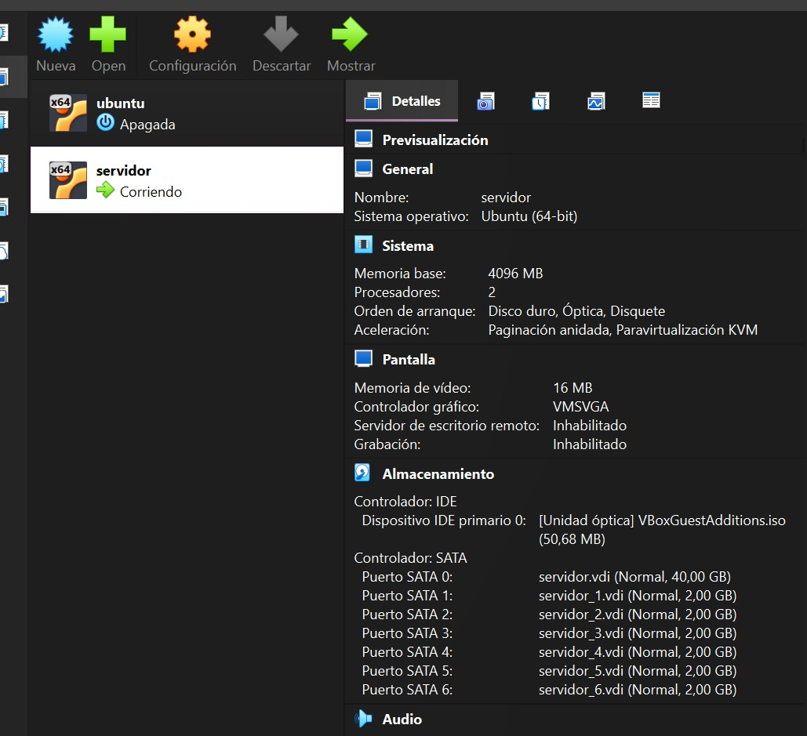
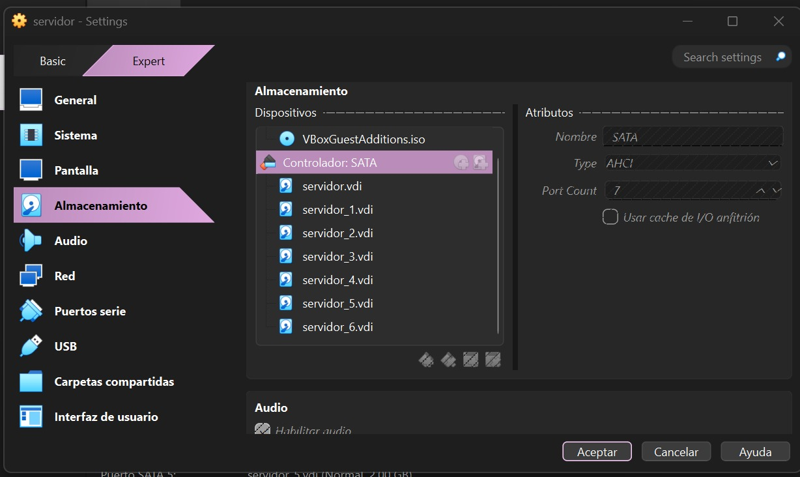

# PARTE 1  
## CONFIGURACIÓN DE LA MÁQUINA VIRTUAL

Inicialmente, se configura y se crea una máquina virtual en VirtualBox con las siguientes especificaciones:

- **Sistema Operativo:** Ubuntu Server 22.04 LTS  
- **RAM:** 4 GB  
- **Procesador:** 2 cores  
- **Disco principal:** 20 GB (para el sistema operativo)  
- **Discos adicionales:** 6 discos de 2 GB cada uno  

**EVIDENCIAS:**
- *Figura 1.* Creación maquina virtual – `CreacionMaquina.jpg`

- *Figura 2.* Visualización de Discos Disponibles – `VisualizacionDiscos.jpg`  
