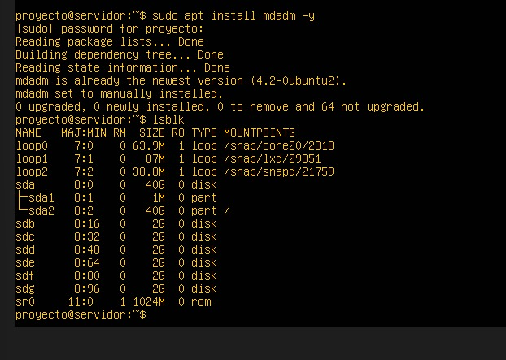
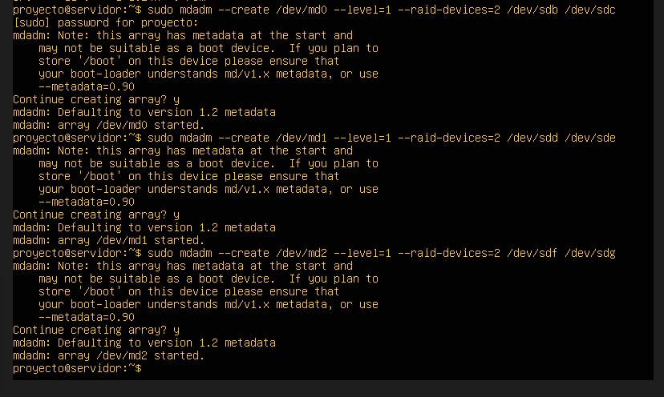
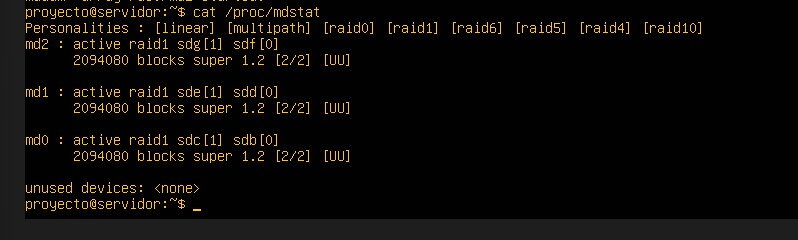

# PARTE 2

## CONFIGURACIÓN DE RAID

Inicialmente se instalan las herramientas necesarias para el manejo y administración de RAIDS y a la vez LVM. Se usa la herramienta mdadm que se usa para crear y gestionar los arreglos RAID. También, permite administrar volumenes lógicos y grupos de volúmenes. La instalación de la herramienta se hizo mediante el comando (sudo apt install mdadm -y) y la verificación de los discos disponibles que se utilizaran para crear los arreglos RAID mediante el siguiente comando (sudo fdisk -l).

**EVIDENCIAS:**
- *Figura 3.* Instalacion de herramientas – `Instalacionmdadm.jpg`

## CREACIÓN DE RAIDS

Se implementaron tres arreglos RAID 1 (mirroring), cada uno compuesto por dos discos de 2 GB, asignándose individualmente a los servicios de Apache, MySQL y Nginx. Esta configuración garantiza redundancia total mediante la replicación automática de datos entre ambos discos de cada arreglo, permitiendo que, ante cualquier falla física en un disco, el servicio mantenga su operatividad ininterrumpida gracias a la copia exacta preservada en el disco espejo, asegurando así la máxima disponibilidad e integridad de la información.

Para la creación de los RAIDS se uso el comando general de (sudo mdadm \--create \--verbose /dev/mdX \--level=1 \--raid-devices=2 /dev/sdX /dev/sdY), donde X es el nombre del dispositivo RAID (md0, md1,md2). La Y, son los discos que van a estar en uso. Finalmente para la verificación del estado de los RAIDS, usamos el comando(cat /proc/mdstat). Finalmente para la verificación del estado de los RAIDS, usamos el comando(cat /proc/mdstat)

| **Elemento** | **Descripción** |
|---|---|
| **\--create** | Inicia la construcción de un nuevo arreglo RAID. |
| **\--verbose** | Muestra información detallada del proceso durante la configuración. |
| **/dev/mdX** | Nombre asignado al dispositivo RAID, como md0, md1 o md2. |
| **\--level=1** | Define el nivel del RAID, en este caso RAID 1 (espejo). |
| **\--raid-devices=2** | Indica la cantidad de discos que conforman el arreglo (dos unidades). |

**EVIDENCIAS:**

- *Figura 4.* Se hace la creacion de los RAIDS – `CreacionRAIDS.jpg`

- *Figura 5.* Se verifica la creacion de los RAIDS – `verificacionRAIDS.jpg`

