# PARTE 3

## CONFIGURACIÓN DE VOLÚMENES LÓGICOS (LVM)

Primeramente, se inició la configuración de LVM, para lo cual fue necesario instalar el paquete lvm2, herramienta fundamental para administrar volúmenes lógicos en Linux. LVM2 permite manejar el almacenamiento de forma flexible, facilitando tareas como ampliar, reducir o reorganizar particiones sin afectar los datos existentes.Esto se realizo mediante el comado (sudo apt install lvm2 -y).

**EVIDENCIAS:**
- *Figura 6.* Instalacion de herramientas – `Instalacionlvm2.jpg`
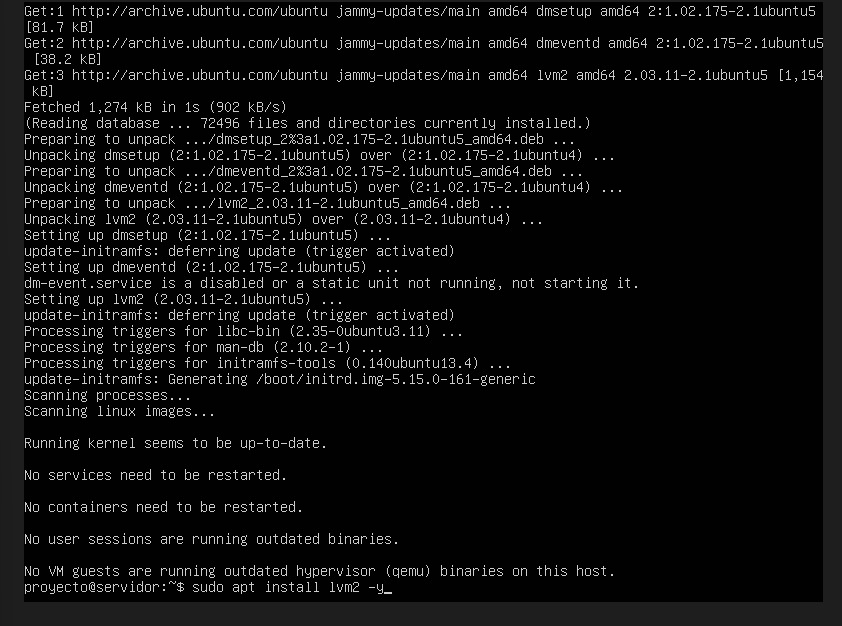
 
## CREACION DE LOS VOLÚMENES FÍSICOS (PV)

En esta fase se procedió a la creación de los volúmenes físicos, que representan la base del sistema LVM. Cada volumen físico actúa como una capa de abstracción sobre los dispositivos de almacenamiento, permitiendo que posteriormente puedan agruparse en grupos de volúmenes y convertirse en volúmenes lógicos más flexibles. Para ello, se utilizaron los tres arreglos RAID previamente configurados, inicializándolos como PV mediante el comando general (sudo pvcreate/dev mdX), dejándolos listos para ser gestionados por LVM. Finalmente se verifico la creación de los volúmenes.

**EVIDENCIAS:**
- *Figura 6.* Se crean los volumens fisicos – `Instalacionlvm2.jpg`
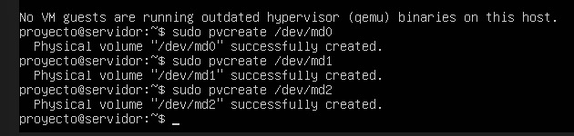

- *Figura 7.* Se verifica la creacion de los PV – `VerificacionPV.jpg`
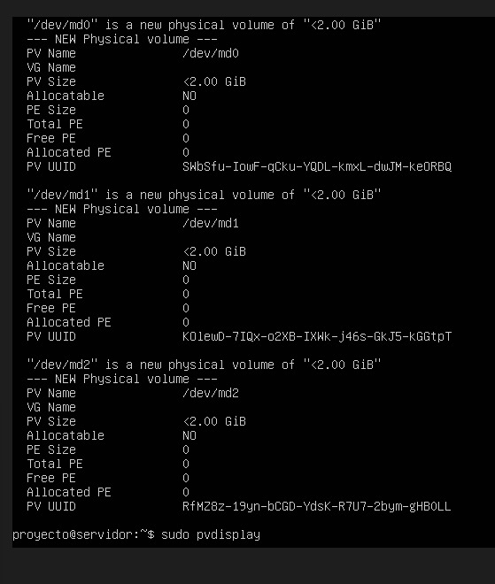

## CREACIÓN DE LOS GRUPOS DE VOLÚMENES (VG)

En este apartado se llevó a cabo la creación de los grupos de volúmenes, que constituyen la segunda capa dentro de la estructura de LVM. Los grupos de volúmenes permiten combinar uno o más volúmenes físicos para formar un espacio de almacenamiento unificado y más fácil de administrar. Con el fin de mantener una organización independiente para cada servicio, se generó un grupo de volúmenes distinto para Apache, MySQL y Nginx, utilizando como base los volúmenes físicos creados sobre cada arreglo RAID. Esto permitió definir tres entornos de almacenamiento separados y listos para la posterior creación de volúmenes lógicos. Esto mediante el comando general (sudo vgcreate vg_X /dev/Y), donde X toma el valor de cada servicio (Apache, MySQL,Nginx), la Y toma el valor de cada dispositivo RAID(md0,md1,md2). Finalmente se hace la verificación de la creación de los grupos de volúmenes.

**EVIDENCIAS:**
- *Figura 8.* Se hace la creacion de los grupos de volumenes – `CreacionVG.jpg`
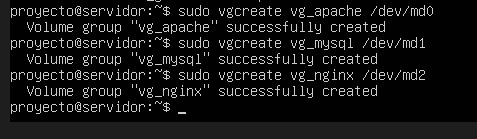

- *Figura 9.* Se verifica la creacion de VG– `VerificacionGruposCreados.jpg`
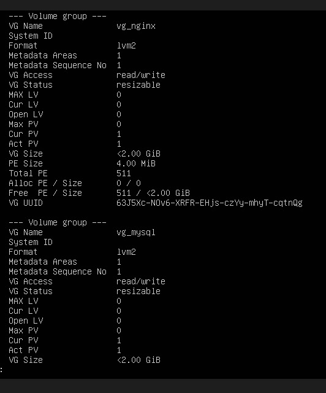

## CREACIÓN DE VOLÚMENES LÓGICOS (LV)

En este apartado se procedió a la creación de los volúmenes lógicos, la capa final dentro de la arquitectura de LVM y la que finalmente será utilizada por los servicios. Los volúmenes lógicos permiten asignar espacios de almacenamiento de manera flexible, pudiendo aumentarse o modificarse según las necesidades del sistema. Para cada servicio Apache, MySQL y Nginx, se generó un volumen lógico independiente con un tamaño de 1.5 GB dentro de sus respectivos grupos de volúmenes, garantizando así una estructura de almacenamiento organizada y fácilmente gestionable. Esto se realiza mediante el comando general (sudo lvcreate -L 1.5G -n lv_X vg_X) donde X toma el valor de cada servicio (Apache, MySQL,Nginx). Finalmente se hace la verificación de los volúmenes lógicos creados.

**EVIDENCIAS:**
- *Figura 10.* Se hace la creacion de los volumenes logicos  – `Instalacionlvm2.jpg`
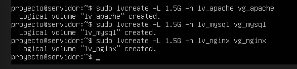

- *Figura 11.* Se verifica la creacion de LV – `Instalacionlvm2.jpg`
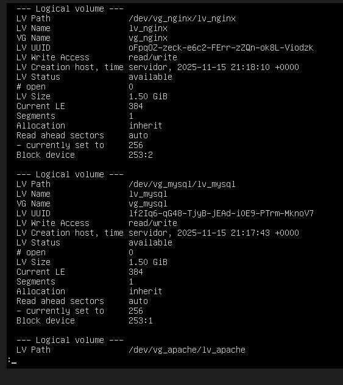
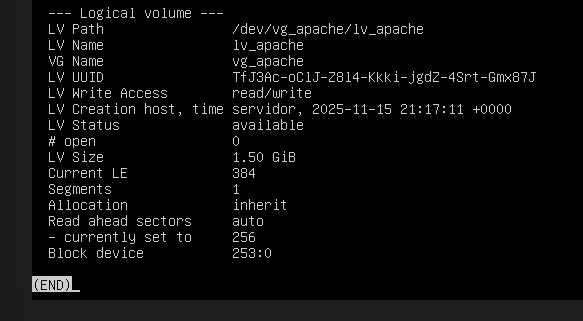

## FORMATEO DE VOLÚMENES LÓGICOS

En este paso se prepararon los volúmenes lógicos para su uso mediante el formateo con el sistema de archivos ext4 con el comando (sudo mkfs.ext4)**,** uno de los más utilizados en entornos Linux por su estabilidad y eficiencia. Este proceso es indispensable para que los volúmenes puedan almacenar datos y ser montados posteriormente en el sistema. Cada volumen lógico asociado a los servicios de Apache, MySQL y Nginx fue formateado individualmente, dejándolos listos para su posterior integración y utilización dentro de la estructura de almacenamiento.

**EVIDENCIAS:**
- *Figura 12.* Se hace el formateo de los volumenes logicos  – `FormateoVolumenesLogicos.jpg`

## CREACIÓN DE PUNTOS DE MONTAJE

En esta apartado se definieron los puntos de montaje, es decir, los directorios del sistema donde se integrarán los volúmenes lógicos previamente formateados. La creación de estos directorios es esencial para que cada servicio pueda acceder a su espacio de almacenamiento correspondiente. Se generaron tres rutas independientes una para Apache, otra para MySQL y otra para Nginx, garantizando así una organización adecuada y una separación lógica de los datos de cada servicio dentro del sistema. Esto con el comando general (sudo mkdir -p /mnt/X-data) donde X toma el valor de cada servicio (Apache, MySQL,Nginx).

Una vez definidos estos directorios, se procedió a montar cada volumen lógico en su ubicación correspondiente, permitiendo que el almacenamiento gestionado mediante LVM quede completamente accesible y operativo para cada uno de los servicios.Esto mediante el comando general (sudo mount /dev/vg_X/lv_X /mnt/X-data) donde X toma el valor de cada servicio (Apache, MySQL,Nginx). Finalmente se verifica la creación de los puntos del montaje

**EVIDENCIAS:**
- *Figura 13.* Se hace la creacion de los puntos de montaje  – `CreacionPuntosMontaje.jpg`
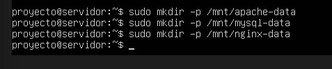

- *Figura 14.* Se montan los volumenes en los respectivos puntos  – `MontajeVolPuntos.jpg`
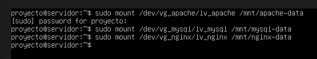

- *Figura 15.* Se verifican los volumenes en sus puntos   – `VerificacionPuntosMontaje.jpg`
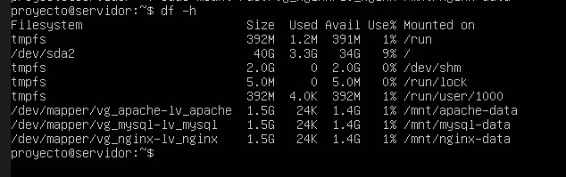
## CONFIGURACIÓN DE MONTAJE AUTOMÁTICO

En este último apartado de la configuración de LVM se habilitó el montaje automático de los volúmenes lógicos, asegurando que cada uno de ellos se cargue de manera correcta cada vez que el sistema se inicia. Para lograrlo, se editó el archivo **/**etc/fstab, donde se registran las reglas de montaje persistente. En este archivo se añadieron las entradas correspondientes a los volúmenes de Apache, MySQL y Nginx, especificando sus puntos de montaje y el sistema de archivos utilizado. Gracias a esta configuración, el almacenamiento queda disponible automáticamente sin necesidad de realizar montajes manuales tras cada reinicio.

**EVIDENCIAS:**
- *Figura 16.* Se hace la configuracion del montaje automatico  – `ConfigMontajeAutomatico.jpg`
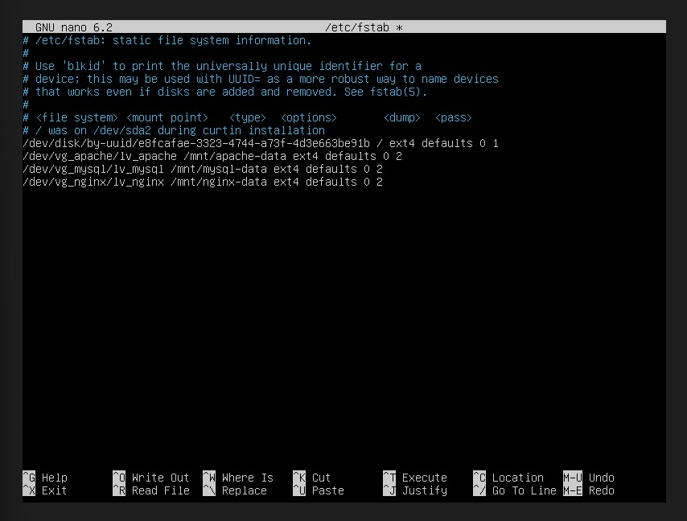