# PARTE 4

## CONFIGURACIÓN DE CREACIÓN IMÁGENES DOCKER PERSONALIZADAS

Antes de iniciar la creación de las imágenes Docker personalizadas, fue necesario preparar el entorno instalando correctamente Docker y sus dependencias. Para ello, primero se añadieron los paquetes requeridos para permitir el uso de repositorios externos y la gestión segura de certificados. Posteriormente, se incorporó la clave GPG oficial de Docker, garantizando la autenticidad de los paquetes descargados, y se añadió el repositorio oficial de Docker al sistema. Después de actualizar los índices de paquetes, se procedió a instalar nuevamente Docker junto con sus componentes esenciales. Finalmente, se verificó la correcta instalación utilizando el comando de comprobación de versión, asegurando así que el motor de contenedores estuviera completamente funcional antes de continuar con la construcción de las imágenes personalizadas.

**EVIDENCIAS:**
- *Figura 17.* Inicialmente se hace la instalacion de docker  – `Dockerinstalacion.jpg`
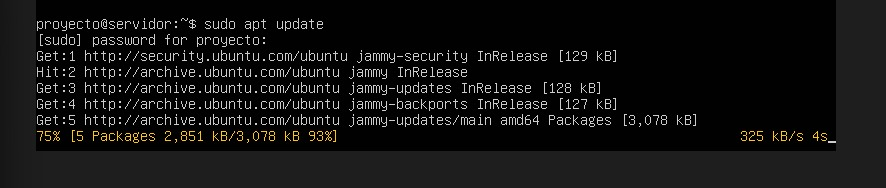

- *Figura 18.* Se hace la instalacion de las dependencias necesarias  – `dependencias.jpg`
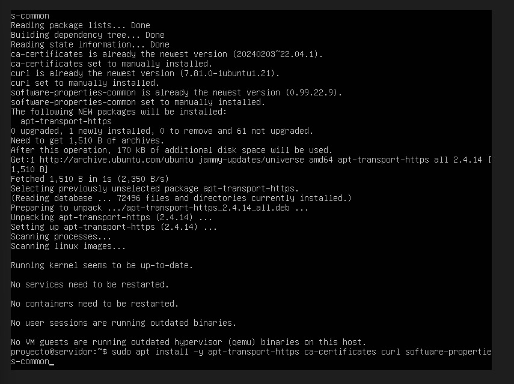

- *Figura 19.* Se agrega la clave GPG de docker y se agrega al repositorio Docker  – `ClaveGPG.jpg`
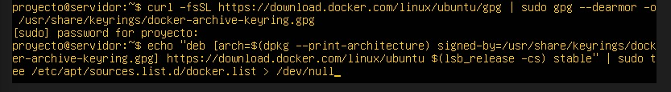

- *Figura 20.* Se hace la actualizacion del docker y dependencias  – `Actualizacion.jpg`
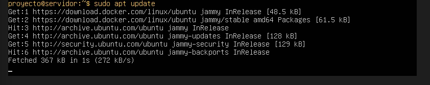

- *Figura 21.* Se hace la instalacion de docker nuevamente  – `InstalcionDocker2.jpg`
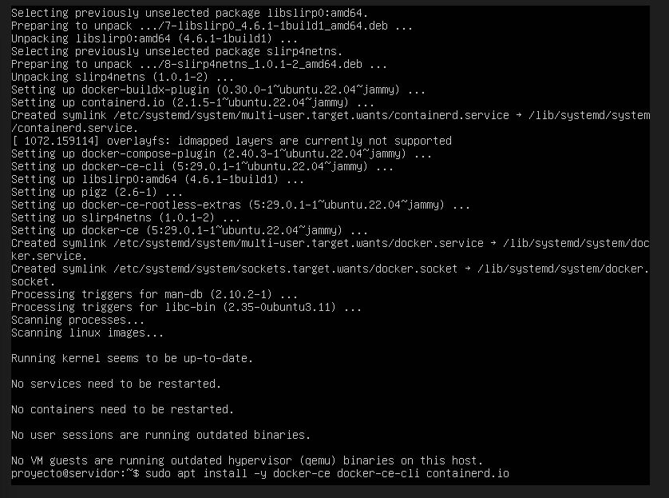

- *Figura 22.* Se verifica su correcta instalacion y su version  – `versionDocker.jpg`
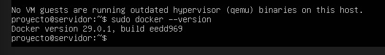

## ESTRUCTURA DEL PROYECTO

Para iniciar la creación de las imágenes Docker personalizadas, primero fue necesario organizar el entorno de trabajo mediante una estructura de directorios bien definida. Esta organización facilita la gestión de los archivos relacionados con cada servicio, permitiendo separar de forma ordenada los recursos de Apache, MySQL y Nginx. Por ello, se creó un directorio principal para el proyecto y, dentro de él, subdirectorios específicos para cada servicio, asegurando así una base estructurada y eficiente para el desarrollo y construcción de las imágenes.

**EVIDENCIAS:**
- *Figura 23.* Inicialmente se hace la creacion de estructuras de directorios– `estructuraProyecto.jpg`
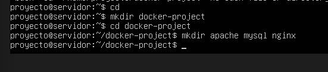

- *Figura 24.* Se verifica la creacion de estructuras de directorios – `verificacionEstructura.jpg`
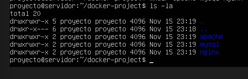

## IMAGEN PERSONALIZADA DE APACHE

En este apartado se desarrolló la imagen Docker personalizada para el servicio Apache, incorporando contenido web propio dentro del contenedor. Para ello, se creó un directorio específico destinado a almacenar los archivos del servidor web, incluyendo una página HTML diseñada especialmente para el proyecto. Luego, se construyó un Dockerfile basado en la imagen oficial de Apache, al cual se le añadió la copia del contenido personalizado y la configuración necesaria para exponer el servicio por el puerto 80. Finalmente, se procedió a construir la imagen personalizada y verificar su correcta creación, dejando lista una versión de Apache adaptada a los requerimientos del proyecto.

**EVIDENCIAS:**
- *Figura 25.* Se crea la imagen personalizada de Apache, un directorio y pagina personalizada html  – `ImagenPersonalizadaApache.jpg`
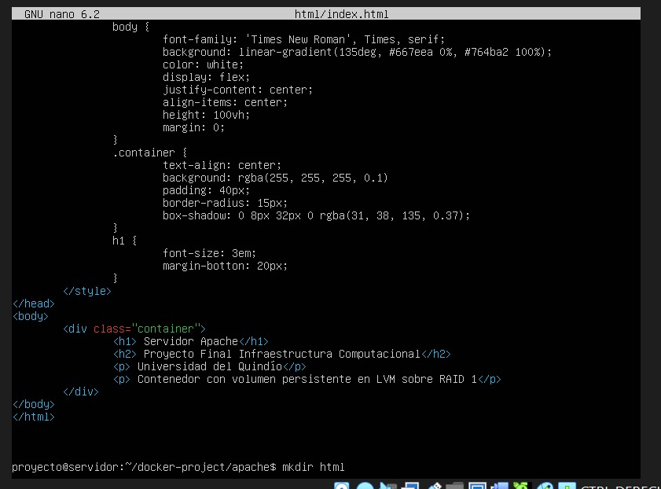

- *Figura 26.* Se muestra su contenido  – `ContenidoImgApache.jpg`
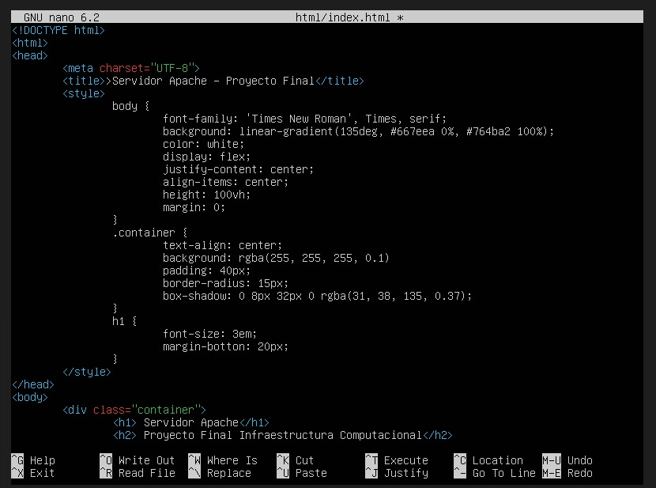
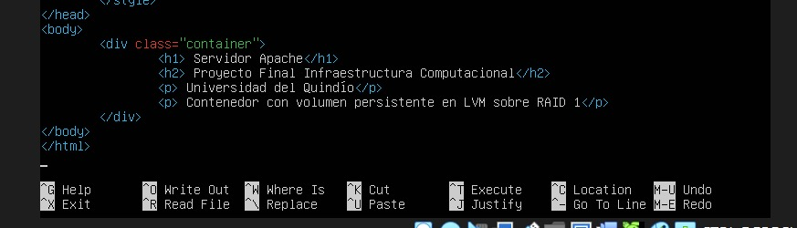

- *Figura 27.* Se crea un Dockfile para apache  – `CreacionDockfileApache.jpg`
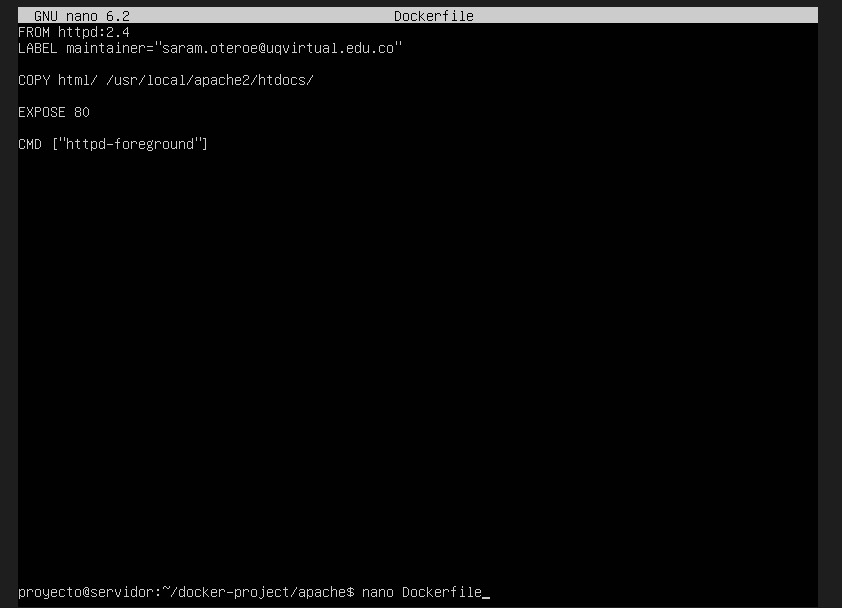

- *Figura 28.* Se construye la imagen personalizada  – `ConstruccionApache.jpg`
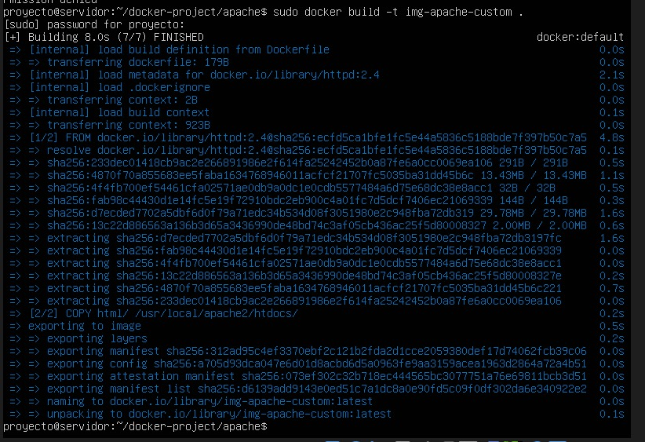

- *Figura 29.* Se verifica su creacion  – `VerificacionApache.jpg`

## IMAGEN PERSONALIZACIÓN DE MySQL

En esta sección se construyó la imagen Docker personalizada para el servicio MySQL**,** configurando parámetros iniciales que permiten que la base de datos esté lista para su uso desde el primer arranque del contenedor. Para ello, se creó un Dockerfile basado en la imagen oficial de MySQL, al cual se añadieron las variables de entorno necesarias para definir la contraseña del usuario root, crear automáticamente una base de datos y establecer un usuario con sus respectivas credenciales. Además, se configuró la exposición del puerto 3306, utilizado por MySQL para las conexiones externas. Una vez definida la configuración, se procedió a construir la imagen personalizada, verificando que el proceso finalizara correctamente para asegurar su disponibilidad dentro del proyecto.

**EVIDENCIAS:**
- *Figura 30.* Se crea la imagen personalizada de MySQL y un dockfile – `ImagenPersonalizadaMySQL.jpg`
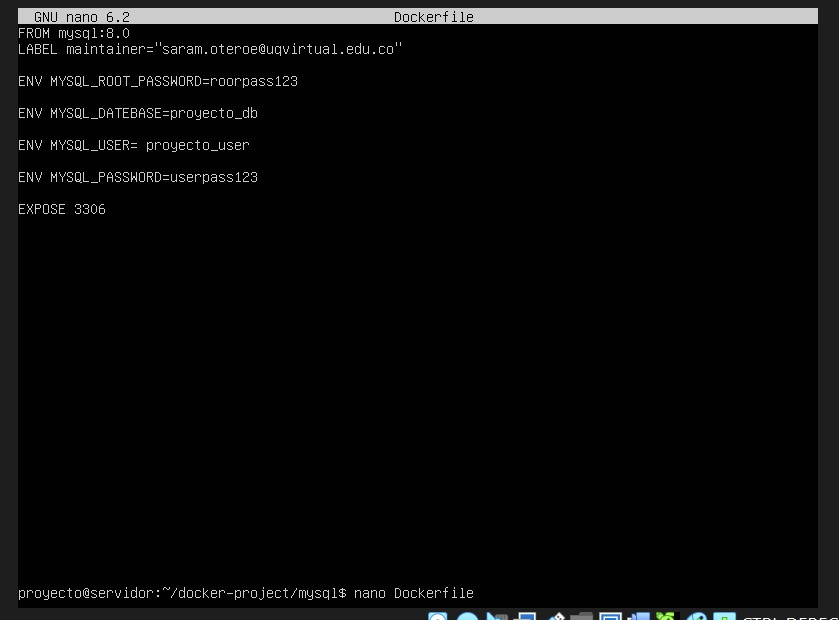

- *Figura 31.* Se construye la imagen personalizada  – `ConstruccionMySQL.jpg`
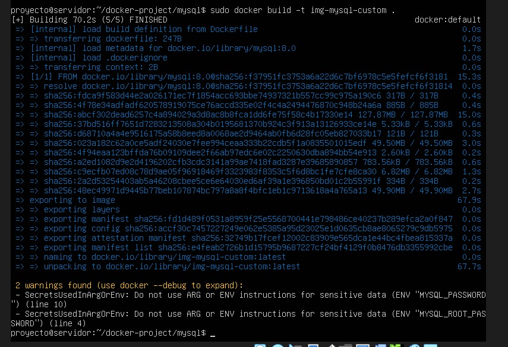

## IMAGEN PERSONALIZADA DE Nginx

La personalización de la imagen de Nginx permite adaptar el servidor web a las necesidades específicas del proyecto, incorporando contenido propio y garantizando un despliegue consistente en cualquier entorno Docker. En esta etapa, se construye una imagen personalizada basada en Nginx, a la cual se integra una página web diseñada específicamente para el proyecto final. Este proceso involucra la creación del contenido HTML, su ubicación dentro de la estructura del contenedor y la configuración del Dockerfile correspondiente. Finalmente, se genera la imagen personalizada y se verifica su correcta creación, asegurando que el servidor Nginx esté listo para ejecutarse con un entorno totalmente personalizado y funcional.

**EVIDENCIAS:**
- *Figura 32.* Se crea la imagen personalizada de Nginx y un directorio html  – `ImagenPersonalizadaNgnix.jpg`
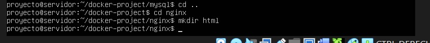

- *Figura 33.* Se muestra su contenido  – `ContenidoImgNgnix.jpg`
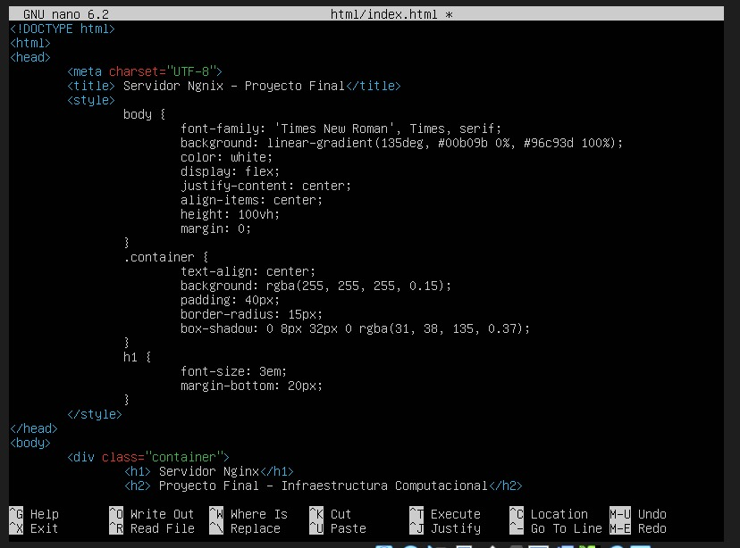
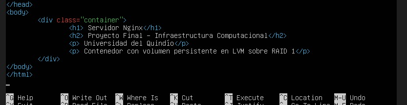

- *Figura 34.* Se crea un Dockfile para Ngnix  – `CreacionDockfileApache.jpg`
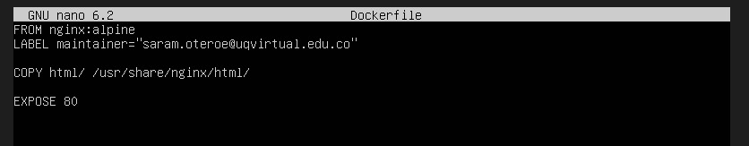

- *Figura 35.* Se construye la imagen personalizada  – `ConstruccionNgnix.jpg`
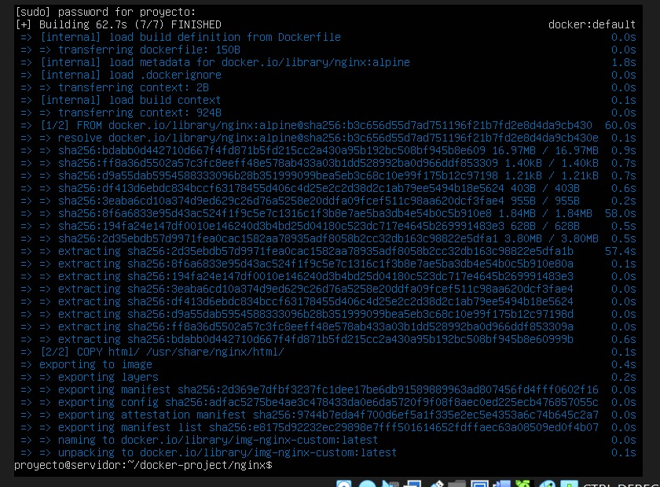

- *Figura 36.* Se verifica su creacion  – `VerificacionNgnix.jpg`

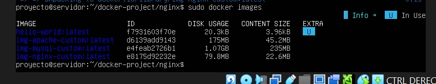
