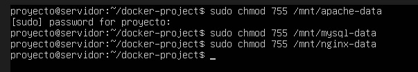
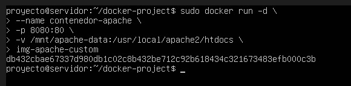
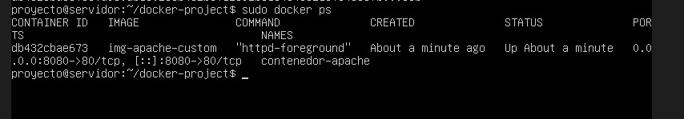
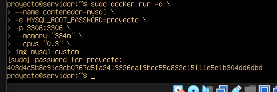
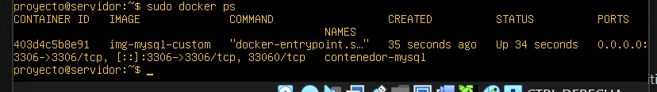
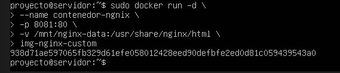
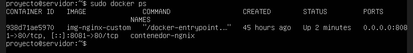

# PARTE 5

## DESPLIEGUE DE CONTENEDORES CON VOLÚMENES

### PREPARACIÓN DE DIRECTORIOS CON PERMISOS

Antes de desplegar los contenedores con sus volúmenes persistentes, es fundamental asegurarse de que los directorios de montaje cuenten con los permisos adecuados. Docker necesita acceso de lectura y escritura para poder almacenar datos dentro de cada volumen asignado. Por esta razón, en esta subparte se realiza la configuración de permisos sobre los directorios correspondientes a Apache, MySQL y Nginx, garantizando así que los contenedores puedan operar correctamente y utilizar sus volúmenes sin restricciones.Esto realizado con el comando(sudo chmod 755 /mnt/X-data) donde X toma el valor de cada servicio (Apache, MySQL,Nginx).Cabe aclarar que -755 donde el propietario tiene todos los permisos, es decir, leer, escribir y ecutar;el grupo y otros únicamente pueden leer y ejecutar.

**EVIDENCIAS:**
- *Figura 37.* Se asignan los permisos necesario-755 – `asignacionPermisos.jpg`

### DESPLIEGUE DEL CONTENEDOR APACHE

Una vez configurados los volúmenes persistentes mediante RAID y LVM, el siguiente paso consiste en desplegar los contenedores que harán uso de ellos. En este punto se procede a crear y ejecutar el contenedor correspondiente a Apache, vinculándolo directamente con su volumen dedicado. Esta integración garantiza que toda la información del servidor web como archivos HTML, estilos o contenido estático permanezca almacenada de forma persistente fuera del contenedor, incluso si este es eliminado o reconstruido. Con ello se asegura la continuidad del servicio y la integridad de los datos almacenados.

**EVIDENCIAS:**
- *Figura 38.* Se hace el despliegue del contenedor Apahe – `DespliegueApache.jpg`

- *Figura 39.* Se hace la verificacion del despliegue `VerificacionApache.jpg`

### DESPLIEGUE DEL CONTENEDOR MySQL

Después de implementar el contenedor Apache, el siguiente paso consiste en desplegar el servicio de base de datos mediante un contenedor MySQL conectado a su volumen persistente LVM. Esta configuración permite que toda la información almacenada en la base de datos, tablas, registros, configuraciones internas y archivos del motor permanezca protegida y accesible incluso si el contenedor se detiene, se actualiza o se recrea. Al vincular el volumen LVM con la ruta interna utilizada por MySQL para guardar sus datos, se garantiza tanto la persistencia como la integridad de la información, aspectos críticos para el funcionamiento de cualquier servicio dependiente de bases de datos.

**EVIDENCIAS:**

- *Figura 40.* Se hace el despliegue del contenedor MySQL – `DespliegueMySQL.jpg`

- *Figura 41.* Se hace la verificacion del despliegue `VerificacionMySQL.jpg`

### DESPLIEGUE DEL CONTENEDOR Nginx

Para completar el despliegue de los servicios web dentro del entorno Docker, se procede a implementar el contenedor Nginx utilizando un volumen persistente basado en LVM. Este volumen permite almacenar el contenido web de manera segura y permanente, de modo que cualquier modificación o actualización realizada sobre los archivos HTML se conserve incluso si el contenedor es reiniciado o recreado. Con esta configuración, el servicio Nginx puede operar de forma estable, asegurando disponibilidad continua del contenido y facilitando la gestión del servidor web dentro de la arquitectura diseñada.

**EVIDENCIAS:**
- *Figura 42.* Se hace el despliegue del contenedor MySQL – `DespliegueNgnix.jpg`

- *Figura 43.* Se hace la verificacion del despliegue `VerificacionNgnix.jpg`
