# PARTE 6

## PRUEBAS DE FUNCIONAMIENTO Y PERSISTENCIA

La fase de pruebas es fundamental para validar que los servicios desplegados operan correctamente dentro del entorno Docker y que la configuración realizada cumple con los objetivos planteados. En esta sección se verifica el funcionamiento de los tres contenedores implementados Apache, Nginx y MySQL evaluando tanto su accesibilidad desde la máquina host como su capacidad de responder adecuadamente a las solicitudes. A través de pruebas de acceso, consultas y visualización de contenido, se confirma que cada servicio está activo, correctamente configurado y funcionando de acuerdo con los parámetros definidos durante su creación.

Una vez comprobado el funcionamiento de los servicios en ejecución, es necesario validar la persistencia de datos en cada contenedor. Dado que el proyecto implementa volúmenes basados en LVM sobre RAID 1, estas pruebas permiten comprobar que la información modificada o generada por los servicios se mantiene incluso después de detener, eliminar o recrear los contenedores. En esta sección se realizan cambios controlados en Apache, MySQL y Nginx, verificando posteriormente que dichos cambios persisten, demostrando así la efectividad y fiabilidad del sistema de almacenamiento persistente configurado.

**EVIDENCIAS:**

**SERVIDOR APACHE**
- *Figura 44.* Se hace la verificacion del IP de la VM (Virtual Machine)-`VerificacionIpVM.jpg`
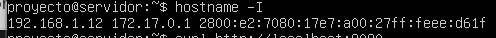

- *Figura 45.* Se hace la verificacion del estado del servidor Apache-`VerificacionServApache.jpg`
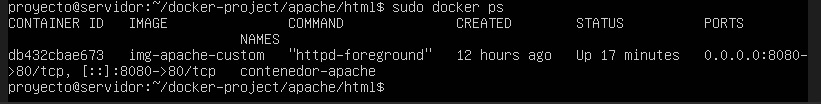

- *Figura 46.* Se muestra el acceso del servidor apache desde la VM -`AccesoApacheVM.jpg`
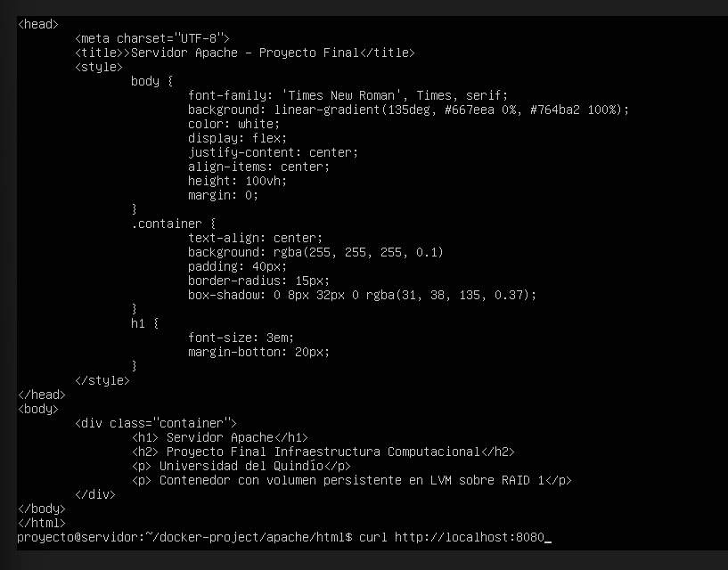

- *Figura 47.* Se muestra el acceso del servidor apache desde el navegador (Maquina host) -`AccesoApacheNaveg.jpg`
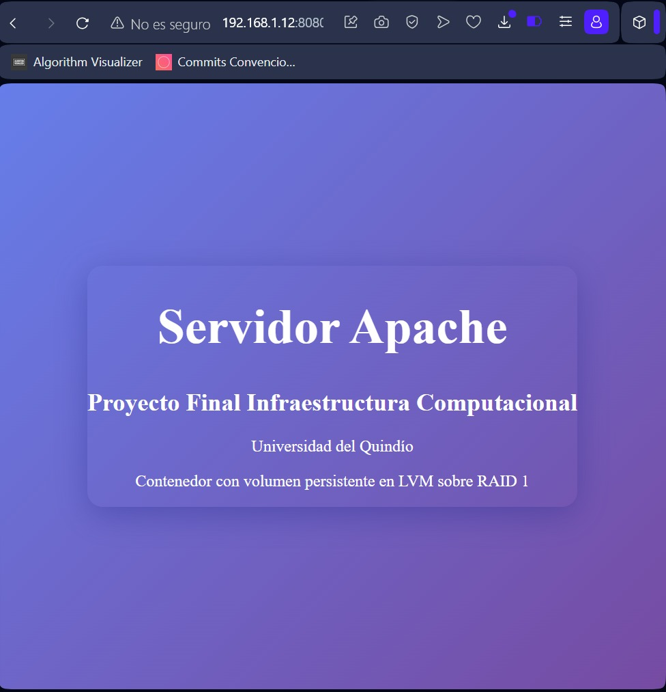

**SERVIDOR NGNIX**

- *Figura 48.* Se copia el archivo index.html personalizado al volumen (LVM) de Ngnix-`ArchivoIndexNgnix.jpg`
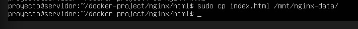

- *Figura 49.* Se verifica el estado del conteneedor-`VerificacaionEstadoNgnix.jpg`
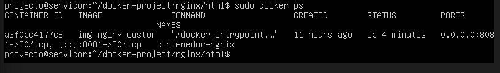

- *Figura 50.* Se muestra el acceso del servidor Ngnix desde la VM -`AccesoNgnixVM.jpg`
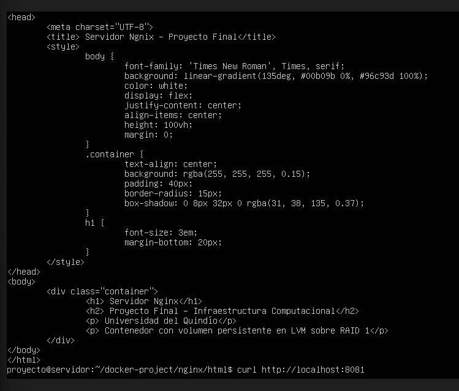

- *Figura 51.* Se muestra el acceso del servidor apache desde el navegador (maquina host) -`AccesoNgnixNaveg.jpg`
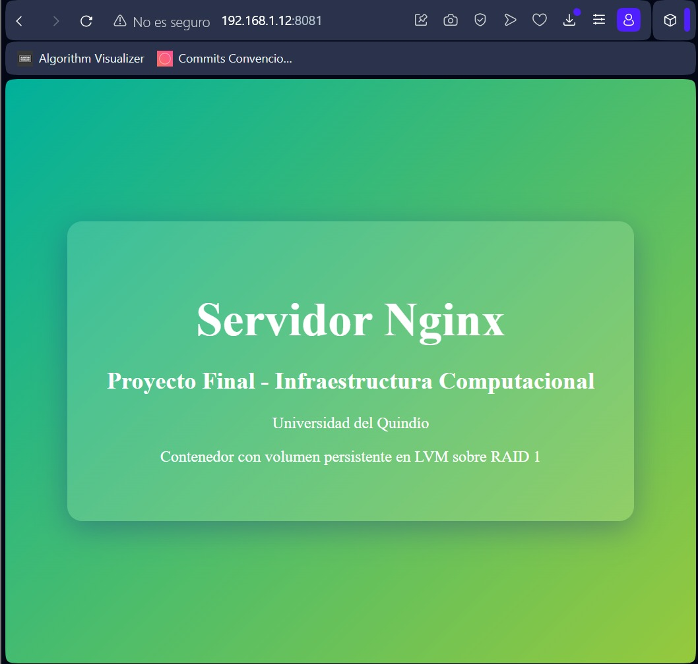

**SERVIDOR MySQL**

- *Figura 52.* Se muestra el acceso al contendor de forma interactiva(Prueba de conexion y uso)-`AccesoInteractivo.jpg`
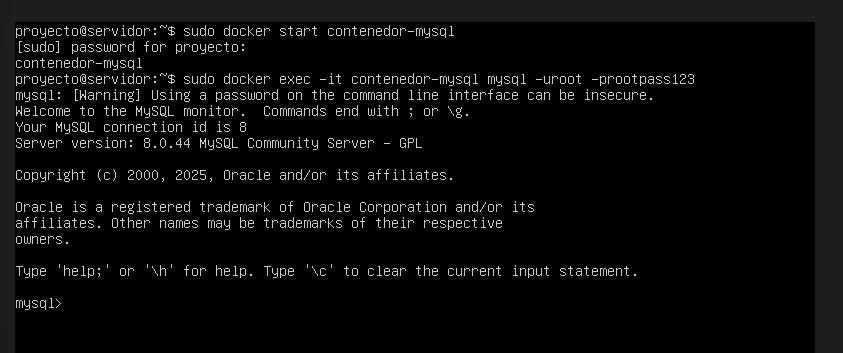

- *Figura 53.* Se verifica la bases de datos(proyecto_db) existente -`VerificacionBD.jpg`
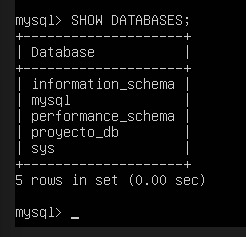

- *Figura 54.* Se hace la creacion de tabla de prueba -`TablaPrueba.jpg`
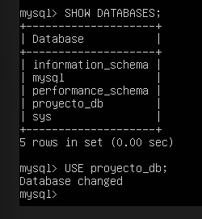
-`TablaPrueba2.jpg`
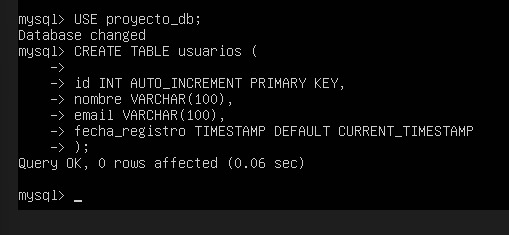

- *Figura 55.* Se hace la prueba insertando datos-`DatosPruebas.jpg`
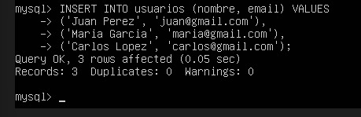

- *Figura 56.* Se hace la consulta de los datos-`ConsultaDatos.jpg`
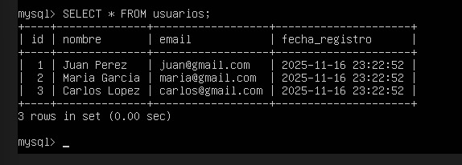
##
**VERIFICACION DE LOS LOGS DE LOS CONTENEDORES**

- *Figura 57.* Se muestra el log de MySQL-`LogsMySQL.jpg`
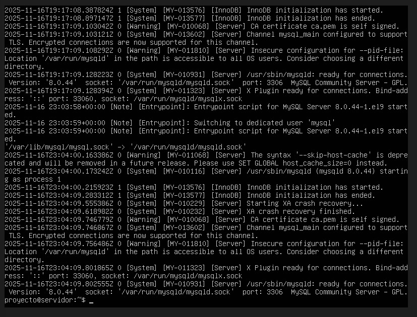

- *Figura 58.* Se muestra el log de Ngnix-`LogsNgnix.jpg`
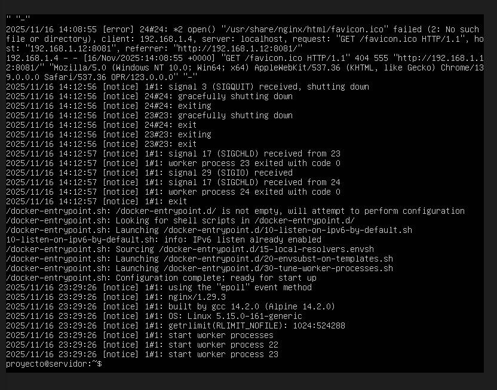

- *Figura 59.* Se muestra el log de Apache-`LogsApache.jpg`
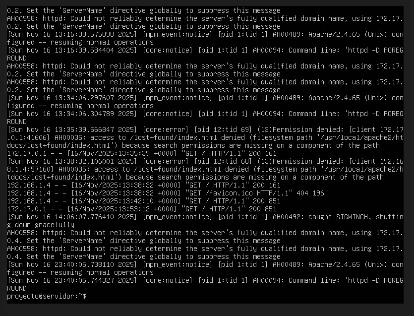

- *Figura 60.* Se hace la verificacion de puertos en uso-`VerificacionPuertos.jpg`
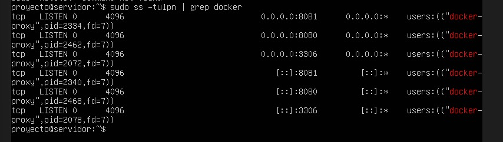

##
**PERSISTENCIA DE DATOS EN APACHE**

- *Figura 61.* Se muestra la modificacion del contenido web-`ModificacionApache.jpg`
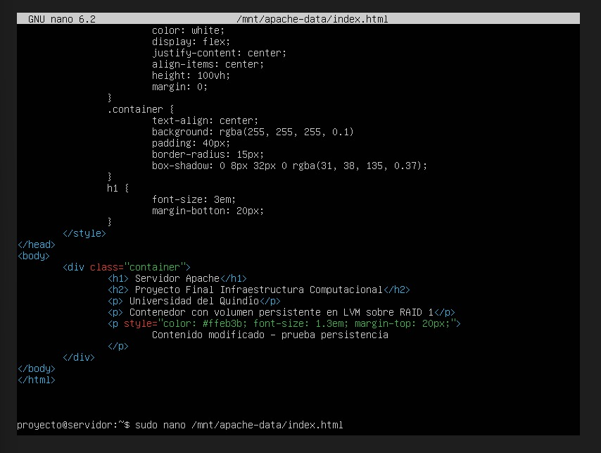

- *Figura 62.* Se reinicia el contenedor-`ReinicioApache.jpg`
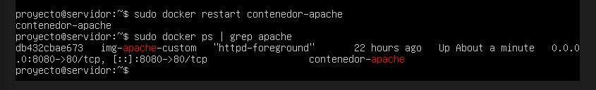

- *Figura 63.* Se accede nuevamente a la paguina para verificar cambios`ApacheCambios.jpg`

- *Figura 64.* Se hace la eliminacion y recreacion del contenedor-`EliminacionRecreacionApache.jpg`
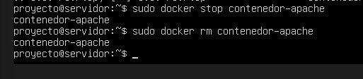

- *Figura 65.* Se verifica la eliminacion-`VerificacionEliminacionApache.jpg`
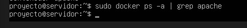

- *Figura 66.* Se crea un contenedor con el mismo nombre y volumen-`NuevoContenedorApache.jpg`
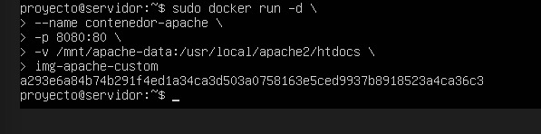

- *Figura 67.* Se verifica por codigo que la informacion persiste-`PersistenciaApache.jpg`
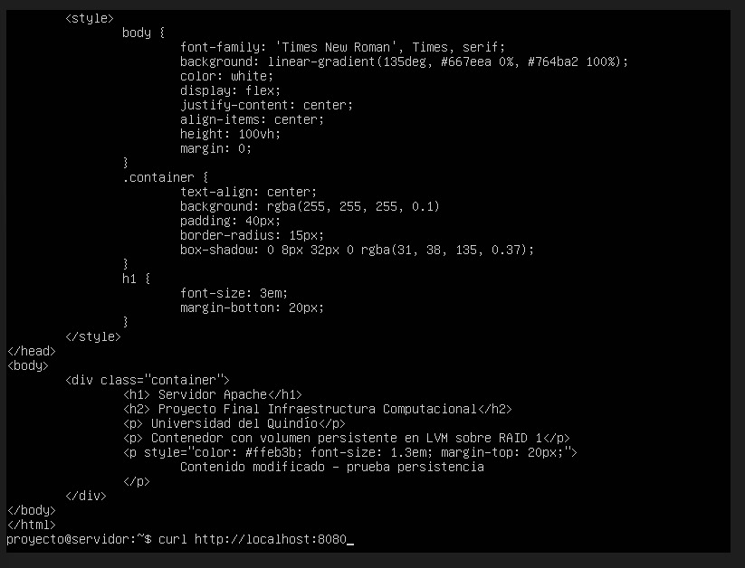

- *Figura 68.* Se accede al servidor`ApacheCambios.jpg`

##
**PERSISTENCIA DE DATOS EN MySQL**

- *Figura 69.* Se accede al contenedor y se verifica el contenido actual de la tabla `TablaContenidoMySQL.jpg`

- *Figura 70.* Se agregan mas datos a la tabla`AgregaDatosMySQL.jpg`
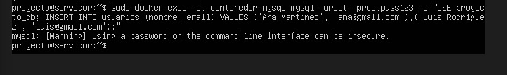

- *Figura 71.* Se verifica que los datos sean agregados`VerificacionTablaMySQL.jpg`
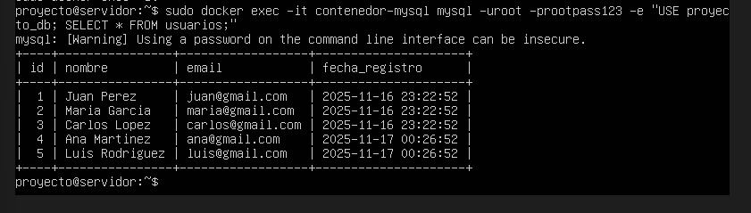

- *Figura 72.* Se reinicia el contenedor y se verifica su estado`ReinicioMySQL.jpg`
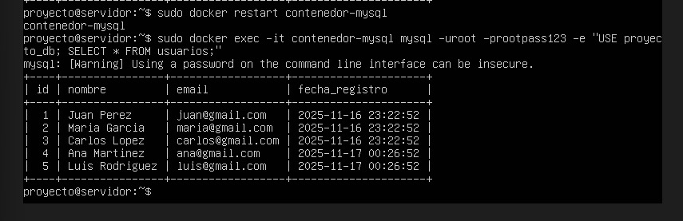

- *Figura 73.* Se hace su eliminacion y verificacion de los datos en el volumen de MySQL`EliminacionMySQL.jpg`
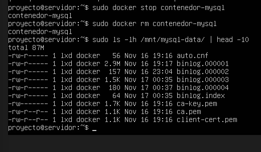

- *Figura 74.* Se Hhace la recreacion del contenedor `RecreacionMySQL.jpg`
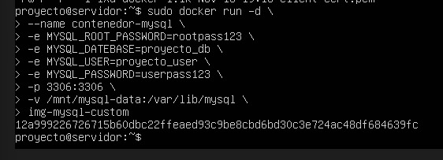

- *Figura 75.* Se hace la verificacaion fianal de la persistencia`PersistenciaMySQL.jpg`

##
**PERSISTENCIA DE DATOS EN NGNIX**
- *Figura 76.* Se modifica el contenido web`ModificacionNgnix.jpg`
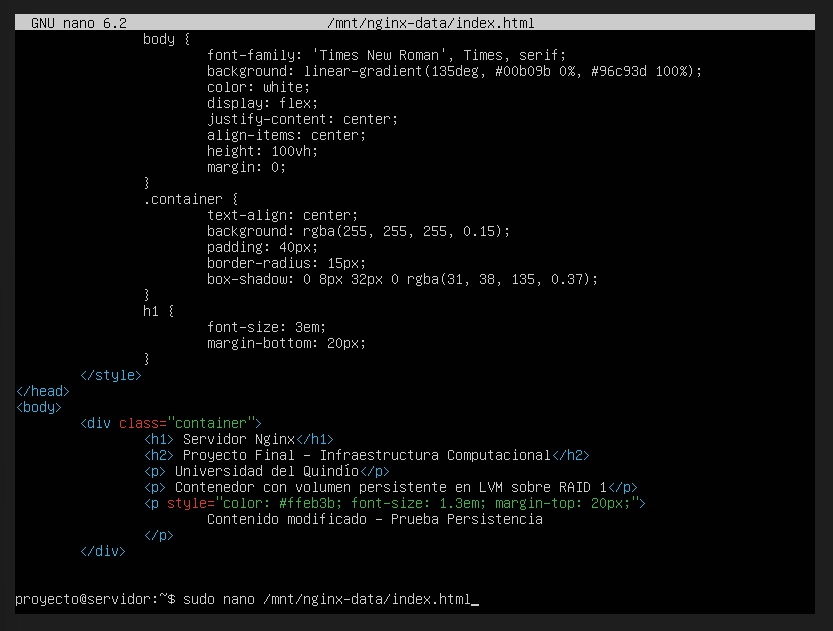

- *Figura 77.* Se verifica el cambio del contenido web`CambiosWebNgnix.jpg`
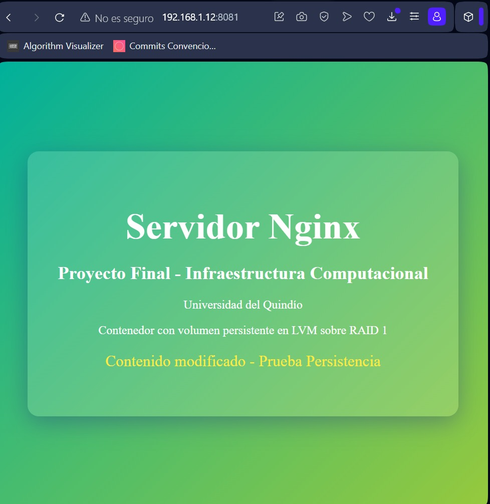

- *Figura 78.* Se reinicia el contenedor`ReinicioNgnix.jpg`
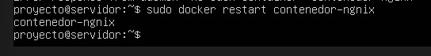

- *Figura 79.* Se verifica la persistencia de datos desde codigo`PersistenciaNgnix.jpg`
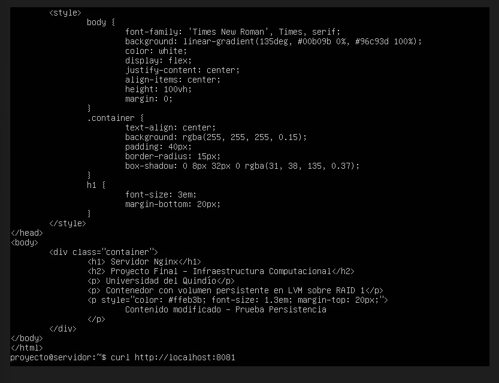

- *Figura 80.* Se hace la eliminacion y recreacion del contenedor`EliminacionRecreacionNgnix.jpg`
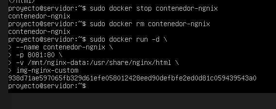

- *Figura 81.* Se hace la verificacion final de la persistencia`PersistenciaFinalNgnix.jpg`
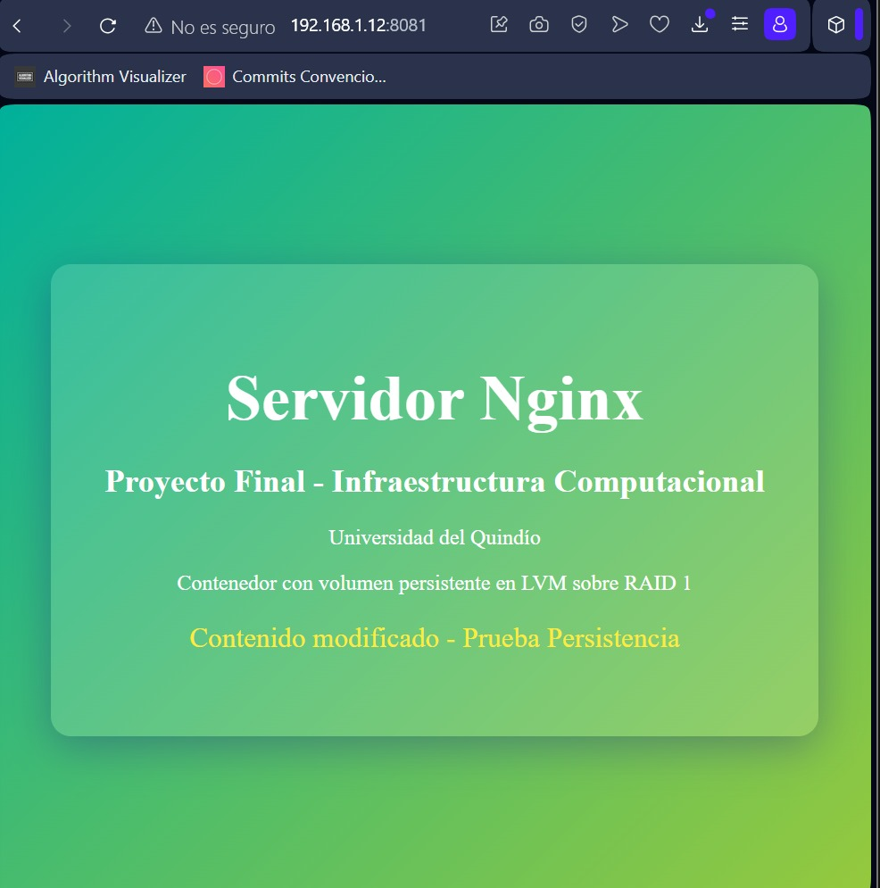