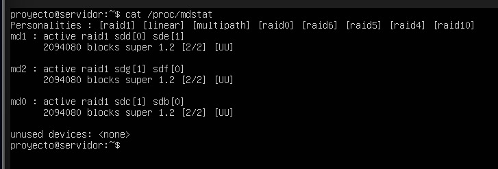
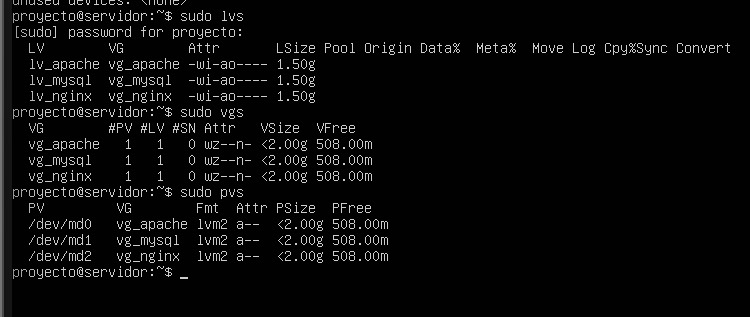
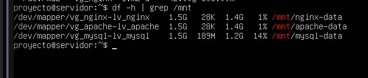

# PARTE 7

## VERIFICACION DE RAID Y LVM

Después de completar el despliegue de los servicios y validar su funcionamiento y persistencia, es esencial comprobar el estado interno de la infraestructura de almacenamiento que los soporta. En esta sección se realiza una verificación detallada de los arreglos RAID y de la estructura LVM , confirmando que ambos sistemas operan correctamente y garantizan la integridad, disponibilidad y administración eficiente del espacio en disco. Estas comprobaciones permiten asegurar que los volúmenes utilizados por los contenedores poseen un funcionamiento estable, redundante y adecuado para el manejo de datos persistentes en entornos productivos.

**EVIDENCIAS:**
- *Figura 82.* Se hace la verificacion del estado de los arreglos RAID-`EstadoRAIDS.jpg`

- *Figura 83.* Se muestra la informacion detallada de los volumenes logicos -`InfoLV.jpg`

- *Figura 84.* Se muestra el uso del espacio de los volumenes-`EspacioVolumenes.jpg`
